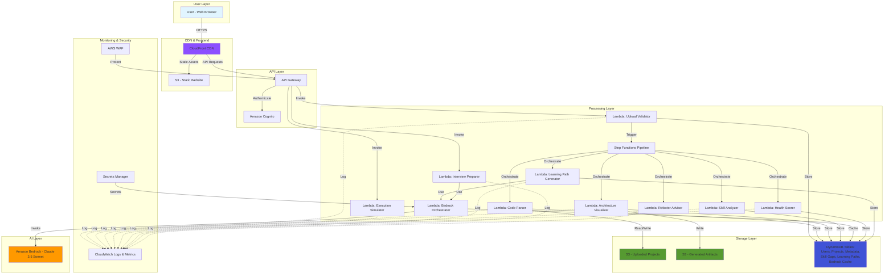

# Technical Design: CodeLens AI

## 1. Overview

CodeLens AI is a serverless, AI-powered platform built entirely on AWS services to democratize code learning for the next 100 million developers in Bharat. The system enables learners to upload project files and receive comprehensive analysis including architecture visualizations, execution simulations, skill gap assessments, and personalized learning roadmaps.

The architecture prioritizes:
- **Accessibility**: Optimized for developers in Tier-2/3 cities
- **Scalability**: Serverless-first design to handle millions of concurrent users
- **Cost-efficiency**: Intelligent caching, token optimization, and pay-per-use model
- **Security**: Sandboxed code analysis with zero code execution
- **Intelligence**: Multi-mode AI explanations powered by Amazon Bedrock

The platform operates entirely on uploaded files without GitHub integration, making it accessible to learners regardless of their development environment or version control familiarity.

## 2. AWS Architecture Components

**Architecture Diagram**: [View Final Architecture Diagram](file:///C:/Users/nehaj/Desktop/Desktop%20Files/1.Rishabh/Academic/College/AWS%202026/CodeLens%20AI%20Folder/final_aws_architecture_hires.png)

### 2.1 Amazon S3 (File Storage)

**Purpose**: Secure, durable storage for uploaded project files and generated artifacts

**Configuration**:
- **Bucket Structure**: 
  - `codelens-uploads-{region}`: User-uploaded source code (encrypted at rest with SSE-S3)
  - `codelens-artifacts-{region}`: Generated visualizations, reports, and cached results
  - `codelens-archive-{region}`: Long-term storage for projects older than 90 days
- **Lifecycle Policies**:
  - Transition to S3 Intelligent-Tiering after 30 days
  - Transition to S3 Glacier after 90 days
  - Delete after 365 days (with user notification at 350 days)
- **Security**:
  - Block all public access
  - Bucket policies enforcing encryption in transit (TLS 1.2+)
  - Pre-signed URLs for temporary access (1-hour expiration)
  - Versioning enabled for audit trail
- **Performance**:
  - Transfer Acceleration enabled for faster uploads from India
  - Multipart upload for files >5MB
  - S3 Select for efficient querying of large JSON metadata files

**Integration Points**:
- Lambda functions read/write via AWS SDK
- CloudFront serves static artifacts via origin access identity
- Step Functions orchestrate S3 operations in processing pipeline

### 2.2 AWS Lambda (Serverless Compute)

**Purpose**: Stateless, event-driven compute for all processing tasks

**Function Inventory**:

1. **upload-validator** (512MB, Python 3.11, 30s timeout)
   - Validates file types, sizes, and malicious patterns
   - Extracts ZIP files and scans contents
   - Triggers: API Gateway POST /upload

2. **code-parser** (2GB, Python 3.11, 5min timeout)
   - Generates AST using tree-sitter for multi-language support
   - Extracts functions, classes, imports, dependencies
   - Triggers: Step Functions state

3. **architecture-visualizer** (1GB, Python 3.11, 3min timeout)
   - Builds dependency graphs using NetworkX
   - Generates Mermaid diagram definitions
   - Detects API patterns and database schemas
   - Triggers: Step Functions state

4. **execution-simulator** (1.5GB, Python 3.11, 5min timeout)
   - Performs static analysis to trace execution paths
   - Builds call graphs and control flow diagrams
   - Simulates variable state changes
   - Triggers: API Gateway POST /simulate

5. **skill-analyzer** (1GB, Python 3.11, 2min timeout)
   - Extracts technical concepts using pattern matching
   - Compares against user skill profile
   - Classifies gaps by priority
   - Triggers: Step Functions state

6. **bedrock-orchestrator** (1GB, Python 3.11, 3min timeout)
   - Manages prompts to Amazon Bedrock
   - Implements chunking strategy for large code
   - Handles retries and error responses
   - Caches responses in DynamoDB
   - Triggers: Multiple (explanation requests, learning path generation)

7. **health-scorer** (1GB, Python 3.11, 2min timeout)
   - Calculates composite health score
   - Analyzes readability, modularity, security, documentation, test coverage
   - Generates improvement suggestions
   - Triggers: Step Functions state

8. **learning-path-generator** (1GB, Python 3.11, 3min timeout)
   - Creates 30-day structured roadmap
   - Allocates time based on user availability
   - Prioritizes critical skill gaps
   - Triggers: Step Functions state

9. **interview-preparer** (1GB, Python 3.11, 2min timeout)
   - Generates technical interview questions
   - Creates resume bullet points
   - Produces system design discussion points
   - Triggers: API Gateway POST /interview-mode

10. **refactor-advisor** (1GB, Python 3.11, 2min timeout)
    - Identifies code smells using static analysis
    - Detects security vulnerabilities
    - Suggests performance optimizations
    - Triggers: Step Functions state

**Optimization Strategies**:
- Lambda layers for shared dependencies (tree-sitter, NetworkX, boto3)
- Provisioned concurrency for latency-sensitive functions (upload-validator, bedrock-orchestrator)
- Environment variables for configuration (Bedrock model IDs, DynamoDB table names)
- X-Ray tracing enabled for performance monitoring
- Reserved concurrent executions to prevent account-level throttling


### 2.3 Amazon API Gateway

**Purpose**: RESTful API interface for frontend-backend communication

**Configuration**:
- **Type**: REST API (not HTTP API) for full feature support
- **Endpoints**:
  - `POST /auth/signup` → Cognito integration
  - `POST /auth/login` → Cognito integration
  - `POST /projects/upload` → upload-validator Lambda
  - `GET /projects/{projectId}` → DynamoDB query via Lambda
  - `GET /projects/{projectId}/architecture` → Returns cached visualization
  - `POST /projects/{projectId}/simulate` → execution-simulator Lambda
  - `GET /projects/{projectId}/health` → Returns health score
  - `GET /projects/{projectId}/learning-path` → Returns roadmap
  - `POST /projects/{projectId}/interview-mode` → interview-preparer Lambda
  - `GET /projects/{projectId}/refactor` → Returns suggestions
  - `PUT /profile` → Updates user profile in DynamoDB
  - `GET /profile/dashboard` → Returns user's projects and progress
- **Security**:
  - Cognito authorizer for all authenticated endpoints
  - API keys for rate limiting (100 req/sec per user)
  - WAF integration to block malicious traffic
  - CORS enabled for web frontend domains
  - Request validation using JSON schemas
- **Performance**:
  - Response caching enabled (TTL: 5 minutes for GET requests)
  - Throttling: 10,000 requests per second account-wide
  - Burst: 5,000 requests
- **Monitoring**:
  - CloudWatch Logs for all requests
  - Detailed metrics (latency, 4xx, 5xx errors)
  - X-Ray tracing for end-to-end request flow

### 2.4 Amazon DynamoDB

**Purpose**: NoSQL database for user profiles, project metadata, and caching

**Table Design**:

1. **Users Table**
   - Partition Key: `userId` (String, Cognito sub)
   - Attributes: `email`, `skillLevel` (1-5), `knownLanguages` (StringSet), `targetRole`, `explanationMode`, `preferredLanguage`, `createdAt`, `lastLogin`
   - GSI: `email-index` for email lookups
   - Billing: On-demand
   - Point-in-time recovery: Enabled

2. **Projects Table**
   - Partition Key: `projectId` (String, UUID)
   - Sort Key: `userId` (String)
   - Attributes: `projectName`, `primaryLanguage`, `fileCount`, `lineCount`, `uploadedAt`, `status` (PROCESSING/COMPLETED/FAILED), `s3Key`, `healthScore`, `processingTime`
   - GSI: `userId-uploadedAt-index` for user dashboard queries
   - TTL: `expiresAt` (90 days from upload)
   - Billing: On-demand

3. **ProjectMetadata Table**
   - Partition Key: `projectId` (String)
   - Attributes: `astData` (Map), `dependencies` (List), `functions` (List), `classes` (List), `apiEndpoints` (List), `databaseSchemas` (Map)
   - Item size: Up to 400KB (DynamoDB limit)
   - Billing: On-demand

4. **SkillGaps Table**
   - Partition Key: `projectId` (String)
   - Attributes: `requiredSkills` (List of Maps), `userSkills` (List), `gaps` (List of Maps with priority), `analyzedAt`
   - Billing: On-demand

5. **LearningPaths Table**
   - Partition Key: `userId` (String)
   - Sort Key: `projectId` (String)
   - Attributes: `roadmap` (Map with 30-day structure), `progress` (Map with daily completion), `completionPercentage`, `createdAt`, `lastUpdated`
   - Billing: On-demand

6. **BedrockCache Table**
   - Partition Key: `codeHash` (String, SHA-256 of code segment)
   - Sort Key: `explanationMode` (String)
   - Attributes: `response` (String, up to 400KB), `tokens`, `cachedAt`
   - TTL: `expiresAt` (7 days from creation)
   - Billing: On-demand
   - Purpose: Reduce Bedrock costs by caching identical explanations

**Performance Optimizations**:
- DynamoDB Accelerator (DAX) for frequently accessed data (Users, Projects)
- Batch operations for bulk reads/writes
- Projection expressions to fetch only required attributes
- Consistent reads only when necessary (eventual consistency default)

### 2.5 Amazon Bedrock

**Purpose**: Managed LLM service for AI-powered code explanations and content generation

**Model Selection**:
- **Primary Model**: Anthropic Claude 3 Sonnet
  - Reasoning: Best balance of cost, performance, and code understanding
  - Context window: 200K tokens
  - Strong at technical explanations and structured output
- **Fallback Model**: Amazon Titan Text Premier
  - Used when Claude is unavailable or rate-limited
  - Lower cost for simple explanations

**Use Cases**:
1. **Code Explanation**: Generate mode-specific explanations (Beginner/Intermediate/Advanced/Interview)
2. **Learning Path Generation**: Create personalized 30-day roadmaps with resource recommendations
3. **Interview Question Generation**: Produce technical questions based on project analysis
4. **Refactor Suggestions**: Provide improvement recommendations with code examples
5. **Architecture Summarization**: Generate high-level architecture descriptions

**Prompt Engineering Strategy**:
- **System Prompt Template**:
  ```
  You are CodeLens AI, an expert programming tutor for Indian developers.
  User Profile: Skill Level {skillLevel}, Known Languages: {knownLanguages}, Target Role: {targetRole}
  Explanation Mode: {explanationMode}
  
  Guidelines:
  - For Beginner mode: Use simple analogies, avoid jargon, explain like teaching a friend
  - For Intermediate mode: Use technical terms with brief definitions, assume basic CS knowledge
  - For Advanced mode: Deep technical insights, performance implications, design patterns
  - For Interview mode: Frame as interview talking points, include system design context
  - Keep responses concise and actionable
  - Use Indian context examples when relevant (e.g., Aadhaar, UPI, Indian e-commerce)
  ```

- **Code Explanation Prompt**:
  ```
  Explain the following {language} code:
  
  ```{language}
  {code_segment}
  ```
  
  Context: This code is part of a {projectType} project with {fileCount} files.
  Focus on: {focusAreas}
  ```

- **Learning Path Prompt**:
  ```
  Create a 30-day learning roadmap for a developer with:
  - Current Skills: {userSkills}
  - Skill Gaps: {gaps}
  - Available Time: 2-4 hours/day
  - Target: Understand and contribute to projects using {requiredSkills}
  
  Structure each day as:
  1. Learning Resource (1 hour) - Free resources accessible in India
  2. Practice Problems (1-1.5 hours) - LeetCode/HackerRank links
  3. Mini Project/Revision (30 mins)
  
  Prioritize Critical gaps in Week 1-2, Important in Week 2-3, Nice-to-have in Week 4.
  ```

**Token Optimization**:
- Maximum 4000 input tokens per request
- Chunking strategy for large files: 500 lines per chunk with 50-line overlap
- Response caching in DynamoDB (7-day TTL)
- Structured output using JSON mode to reduce parsing overhead

**Cost Management**:
- Estimated cost: $0.003 per 1K input tokens, $0.015 per 1K output tokens (Claude Sonnet)
- Target: <$0.10 per project analysis
- Monthly budget alarm at $1000
- Automatic fallback to Titan if budget threshold reached

### 2.6 Amazon Cognito

**Purpose**: User authentication, authorization, and profile management

**Configuration**:
- **User Pool**:
  - Sign-up attributes: email (required, verified), name
  - Password policy: Minimum 8 characters, uppercase, lowercase, number, special character
  - MFA: Optional (SMS or TOTP)
  - Email verification required before first login
  - Custom attributes: `skillLevel`, `knownLanguages`, `targetRole`, `explanationMode`, `preferredLanguage`
- **App Client**:
  - OAuth 2.0 flows: Authorization code grant
  - Token expiration: Access token (1 hour), Refresh token (30 days)
  - Allowed OAuth scopes: openid, email, profile
- **Triggers** (Lambda):
  - Pre-signup: Validate email domain (optional for enterprise)
  - Post-confirmation: Create user record in DynamoDB Users table
  - Pre-token generation: Add custom claims (userId, skillLevel)
- **Security**:
  - Advanced security features enabled (compromised credentials check)
  - Account takeover protection
  - Adaptive authentication based on risk score

**Integration**:
- API Gateway uses Cognito authorizer for protected endpoints
- Frontend uses Amplify Auth library for seamless integration
- JWT tokens include custom claims for user context

### 2.7 Amazon CloudFront

**Purpose**: Global CDN for low-latency content delivery and static asset hosting

**Configuration**:
- **Origins**:
  - S3 bucket for frontend static files (React/Next.js build)
  - S3 bucket for generated artifacts (visualizations, reports)
  - API Gateway for dynamic API requests
- **Behaviors**:
  - `/` → S3 static website (SPA routing with custom error responses)
  - `/api/*` → API Gateway (no caching for dynamic data)
  - `/assets/*` → S3 artifacts (cache TTL: 1 day)
- **Edge Locations**: Focus on Indian regions (Mumbai, Delhi, Chennai, Bangalore)
- **Compression**: Gzip and Brotli enabled for text-based content
- **Security**:
  - Origin Access Identity (OAI) for S3 access
  - HTTPS only (redirect HTTP to HTTPS)
  - AWS WAF integration for DDoS protection
  - Custom SSL certificate via ACM
- **Performance**:
  - Cache hit ratio target: >80%
  - Lambda@Edge for request/response manipulation (e.g., adding security headers)
  - Origin Shield enabled for additional caching layer


### 2.8 AWS Step Functions

**Purpose**: Orchestrate multi-step processing pipeline for uploaded projects

**State Machine**: `ProjectAnalysisPipeline`

**Workflow States**:

1. **ValidateUpload** (Task)
   - Lambda: upload-validator
   - Input: `{ projectId, userId, s3Key }`
   - Output: `{ valid, fileCount, primaryLanguage, totalLines }`
   - Error handling: Retry 3x with exponential backoff, catch and fail gracefully

2. **ParseCode** (Task)
   - Lambda: code-parser
   - Input: Previous output + s3Key
   - Output: `{ astData, functions, classes, imports, dependencies }`
   - Timeout: 5 minutes
   - Error handling: Retry 3x, log failure, continue with partial data

3. **ParallelAnalysis** (Parallel)
   - Branch 1: **GenerateArchitecture** (Task)
     - Lambda: architecture-visualizer
     - Output: `{ folderTree, dependencyGraph, apiMap, dbSchema }`
   - Branch 2: **AnalyzeSkills** (Task)
     - Lambda: skill-analyzer
     - Output: `{ requiredSkills, gaps, priority }`
   - Branch 3: **CalculateHealth** (Task)
     - Lambda: health-scorer
     - Output: `{ healthScore, breakdown, suggestions }`
   - Branch 4: **GenerateRefactorAdvice** (Task)
     - Lambda: refactor-advisor
     - Output: `{ codeSmells, securityIssues, performanceIssues }`

4. **GenerateLearningPath** (Task)
   - Lambda: learning-path-generator
   - Input: Skill gaps from previous step
   - Output: `{ roadmap, estimatedDuration }`
   - Requires Bedrock invocation

5. **UpdateProjectStatus** (Task)
   - Lambda: Simple update function
   - Updates DynamoDB Projects table with status=COMPLETED
   - Stores all analysis results

6. **NotifyUser** (Task)
   - Lambda: Sends SNS notification or in-app notification
   - Input: `{ userId, projectId, status }`

**Error Handling**:
- Each state has retry policy (3 attempts, exponential backoff starting at 2s)
- Catch blocks transition to **FailureHandler** state
- FailureHandler updates project status to FAILED and notifies user

**Execution Tracking**:
- CloudWatch Logs for each execution
- X-Ray tracing for performance analysis
- Execution history retained for 90 days

**Cost Optimization**:
- Express workflows for fast, short-lived executions (<5 min)
- Standard workflows for longer processing (>5 min)
- Estimated cost: $0.025 per 1000 state transitions

### 2.9 Amazon CloudWatch

**Purpose**: Centralized logging, monitoring, and alerting

**Log Groups**:
- `/aws/lambda/upload-validator`
- `/aws/lambda/code-parser`
- `/aws/lambda/architecture-visualizer`
- `/aws/lambda/execution-simulator`
- `/aws/lambda/skill-analyzer`
- `/aws/lambda/bedrock-orchestrator`
- `/aws/lambda/health-scorer`
- `/aws/lambda/learning-path-generator`
- `/aws/lambda/interview-preparer`
- `/aws/lambda/refactor-advisor`
- `/aws/apigateway/codelens-api`
- `/aws/stepfunctions/ProjectAnalysisPipeline`

**Metrics**:
- **Lambda**: Invocations, Duration, Errors, Throttles, Concurrent Executions
- **API Gateway**: Count, Latency, 4XXError, 5XXError, CacheHitCount, CacheMissCount
- **DynamoDB**: ConsumedReadCapacityUnits, ConsumedWriteCapacityUnits, UserErrors, SystemErrors
- **Bedrock**: InvocationCount, TokensUsed, Latency, Errors
- **Step Functions**: ExecutionsStarted, ExecutionsSucceeded, ExecutionsFailed, ExecutionTime

**Alarms**:
1. **High Error Rate**: Lambda errors >5% over 5 minutes → SNS notification
2. **High Latency**: API Gateway p99 latency >10s → SNS notification
3. **Bedrock Cost**: Daily Bedrock spend >$100 → SNS notification + auto-throttle
4. **DynamoDB Throttling**: ThrottledRequests >10 over 5 minutes → SNS notification
5. **Step Function Failures**: ExecutionsFailed >10 over 15 minutes → SNS notification

**Dashboards**:
- **Operations Dashboard**: Real-time system health, error rates, latency
- **Cost Dashboard**: Daily spend by service, Bedrock token usage, S3 storage costs
- **User Analytics Dashboard**: Active users, projects analyzed, feature usage, completion rates

**Log Retention**:
- Lambda logs: 30 days
- API Gateway logs: 30 days
- Step Functions logs: 90 days

### 2.10 Amazon OpenSearch (Optional)

**Purpose**: Advanced code search and semantic indexing for large projects

**Use Case**:
- Enable full-text search across uploaded codebases
- Semantic code search using vector embeddings
- Find similar code patterns across projects
- Search by function name, class name, or code snippet

**Configuration**:
- **Domain**: `codelens-code-search`
- **Instance Type**: t3.small.search (2 instances for HA)
- **Storage**: 100GB EBS (gp3)
- **Index Structure**:
  - `code-files`: Individual file contents with metadata
  - `code-functions`: Extracted functions with signatures and docstrings
  - `code-classes`: Extracted classes with methods
- **Vector Search**: Use Amazon Bedrock embeddings for semantic search
- **Access**: VPC-based with Lambda in same VPC

**Cost Consideration**:
- Optional feature for v2
- Estimated cost: $100-200/month for small deployment
- Can be enabled per-user or per-project basis

## 3. Architecture Diagram



**Detailed Architecture Diagram**: [View Final AWS Architecture (High Resolution)](file:///C:/Users/nehaj/Desktop/Desktop%20Files/1.Rishabh/Academic/College/AWS%202026/CodeLens%20AI%20Folder/final_aws_architecture_hires.png)

## 4. Data Flow

### 4.1 Project Upload and Analysis Flow

**Step-by-Step Process**:

1. **User Initiates Upload**
   - User selects ZIP file or folder via web/mobile interface
   - Frontend validates file size (<50MB) and type
   - Frontend requests pre-signed S3 URL from API Gateway

2. **Pre-Signed URL Generation**
   - API Gateway invokes Lambda function
   - Lambda generates pre-signed POST URL with 1-hour expiration
   - URL includes metadata: userId, projectId (UUID), timestamp
   - Returns URL to frontend

3. **Direct S3 Upload**
   - Frontend uploads file directly to S3 using pre-signed URL
   - Bypasses API Gateway for large file transfer efficiency
   - S3 triggers Lambda (upload-validator) via event notification

4. **Upload Validation**
   - upload-validator Lambda extracts ZIP contents
   - Scans for malicious file types (.exe, .dll, .so)
   - Validates file extensions and structure
   - Creates initial record in DynamoDB Projects table (status=PROCESSING)
   - Triggers Step Functions state machine

5. **Code Parsing**
   - code-parser Lambda reads files from S3
   - Uses tree-sitter to generate AST for each source file
   - Extracts:
     - Function definitions with signatures and docstrings
     - Class definitions with methods and attributes
     - Import/require statements
     - Module dependencies
   - For large projects (>5000 lines), processes files in parallel batches
   - Stores ProjectMetadata in DynamoDB

6. **Parallel Analysis Phase**
   - Step Functions executes 4 branches concurrently:
   
   **Branch A: Architecture Visualization**
   - architecture-visualizer reads ProjectMetadata
   - Builds folder hierarchy tree
   - Creates dependency graph using NetworkX
   - Detects API patterns (Express routes, Flask endpoints, Spring controllers)
   - Infers database schemas from ORM models
   - Generates Mermaid diagram definitions
   - Stores visualization data in S3 artifacts bucket
   
   **Branch B: Skill Analysis**
   - skill-analyzer extracts technical concepts:
     - Frameworks (React, Django, Spring Boot)
     - Design patterns (Singleton, Factory, Observer)
     - Algorithms (sorting, searching, graph traversal)
     - Data structures (trees, graphs, hash maps)
   - Queries DynamoDB for user's skill profile
   - Compares required vs. current skills
   - Classifies gaps by priority (Critical/Important/Nice-to-have)
   - Stores SkillGaps in DynamoDB
   
   **Branch C: Health Scoring**
   - health-scorer analyzes code quality:
     - Readability: Cyclomatic complexity, function length, naming conventions
     - Modularity: Coupling, cohesion, separation of concerns
     - Security: Hardcoded secrets, SQL injection patterns, XSS vulnerabilities
     - Documentation: Docstring coverage, README presence
     - Test Coverage: Test file detection, test-to-code ratio
   - Calculates composite score: (0.25×R + 0.20×M + 0.20×S + 0.15×D + 0.20×T)
   - Stores health score in Projects table
   
   **Branch D: Refactor Analysis**
   - refactor-advisor identifies issues:
     - Code smells (long functions, duplicate code, large classes)
     - Naming issues (single-letter variables, unclear names)
     - Performance issues (nested loops, inefficient algorithms)
     - Security vulnerabilities with severity classification
   - Prioritizes suggestions by impact and effort
   - Stores recommendations in DynamoDB

7. **Learning Path Generation**
   - learning-path-generator reads SkillGaps from DynamoDB
   - Invokes bedrock-orchestrator with structured prompt
   - bedrock-orchestrator:
     - Checks DynamoDB cache for similar skill gap patterns
     - If cache miss, calls Bedrock Claude 3 Sonnet
     - Enforces JSON output format for structured roadmap
     - Caches response with 7-day TTL
   - Generates 30-day roadmap:
     - Week 1-2: Critical gaps
     - Week 2-3: Important gaps
     - Week 4: Nice-to-have gaps
   - Each day includes: Learning resource (1h), Practice problems (1-1.5h), Mini project (30min)
   - Stores LearningPath in DynamoDB

8. **Pipeline Completion**
   - Step Functions updates Projects table (status=COMPLETED)
   - Sends notification to user (SNS → Email/SMS or in-app)
   - Total processing time: 30-180 seconds depending on project size

9. **User Views Results**
   - User refreshes dashboard
   - Frontend queries API Gateway GET /projects/{projectId}
   - Lambda retrieves data from DynamoDB and S3
   - Returns comprehensive analysis:
     - Architecture visualizations
     - Health score with breakdown
     - Skill gaps with priorities
     - 30-day learning roadmap
     - Refactor suggestions
   - CloudFront caches response for 5 minutes

### 4.2 Execution Simulation Flow

1. **User Selects Function**
   - User clicks "Simulate Execution" on a specific function
   - Frontend sends POST /projects/{projectId}/simulate with functionName

2. **Static Analysis**
   - execution-simulator Lambda retrieves ProjectMetadata
   - Builds call graph starting from selected function
   - Traces execution path using control flow analysis
   - Identifies:
     - Function calls in order
     - Variable assignments and state changes
     - Conditional branches (if/else)
     - Loops with iteration logic
     - Recursion with call stack depth

3. **Step Generation**
   - Creates ordered sequence of execution steps
   - For each step, includes:
     - Step number
     - Code line number
     - Action description
     - Variable state (with example values)
     - Call stack snapshot
   - Limits to 100 steps (summarizes if longer)

4. **Response**
   - Returns structured JSON with execution trace
   - Frontend renders interactive step-by-step visualization
   - User can step forward/backward through execution

### 4.3 Interview Mode Flow

1. **User Activates Interview Mode**
   - User clicks "Interview Prep" for a project
   - Frontend sends POST /projects/{projectId}/interview-mode

2. **Question Generation**
   - interview-preparer Lambda retrieves ProjectMetadata and SkillGaps
   - Invokes bedrock-orchestrator with interview-focused prompt
   - Bedrock generates:
     - 10-15 technical questions covering:
       - Code explanation questions
       - Design decision questions
       - Scalability questions
       - Trade-off discussions
     - System design breakdown
     - 3-5 resume bullet points (STAR format)
     - Viva-style "why" and "how" questions

3. **Response**
   - Returns structured interview preparation package
   - Includes model answers with key talking points
   - Frontend displays in interview practice interface


## 5. AI Pipeline Design

### 5.1 Code Parsing Strategy

**Multi-Language Support**:
- **Parser**: tree-sitter (incremental parsing, error-tolerant)
- **Supported Languages**: Python, JavaScript, TypeScript, Java, C++, Go, Ruby, PHP
- **Language Detection**: 
  - File extension mapping
  - Shebang line detection
  - Content-based heuristics for ambiguous cases

**AST Extraction Process**:
1. Read source file from S3
2. Detect language and load appropriate tree-sitter grammar
3. Parse file into AST
4. Traverse AST to extract:
   - Function nodes: name, parameters, return type, body, docstring
   - Class nodes: name, methods, attributes, inheritance
   - Import nodes: module name, imported symbols
   - Variable declarations: name, type, initial value
5. Handle parsing errors gracefully (log and continue)
6. Store extracted data as structured JSON in DynamoDB

**Performance Optimization**:
- Parse files in parallel (up to 10 concurrent Lambda invocations)
- Cache parsed ASTs for 90 days
- Skip binary files and generated code (node_modules, build artifacts)

### 5.2 Chunking Strategy for Large Projects

**Problem**: Bedrock has token limits (200K for Claude, but optimal prompts are <4K tokens)

**Solution**: Intelligent chunking with context preservation

**Chunking Algorithm**:
1. **File-Level Chunking**:
   - If file <500 lines: Process as single chunk
   - If file >500 lines: Split into chunks of 500 lines with 50-line overlap
   - Overlap ensures context continuity (function definitions, class context)

2. **Semantic Chunking**:
   - Prefer splitting at function/class boundaries
   - Never split inside a function body
   - Include parent class context when chunking methods

3. **Context Injection**:
   - Each chunk includes:
     - File path and line numbers
     - Parent class/module context
     - Import statements from file header
     - Brief summary of previous chunk (if applicable)

4. **Chunk Metadata**:
   ```json
   {
     "chunkId": "uuid",
     "projectId": "uuid",
     "filePath": "src/services/auth.py",
     "startLine": 1,
     "endLine": 500,
     "language": "python",
     "context": {
       "parentClass": "AuthService",
       "imports": ["jwt", "bcrypt", "datetime"],
       "previousSummary": "Defined user authentication methods"
     },
     "content": "..."
   }
   ```

### 5.3 Prompt Engineering Approach

**Principle**: Mode-specific prompts with structured output enforcement

**Base System Prompt**:
```
You are CodeLens AI, an expert programming tutor designed for Indian developers.

User Context:
- Skill Level: {skillLevel}/5
- Known Languages: {knownLanguages}
- Target Role: {targetRole}
- Explanation Mode: {explanationMode}

Your mission: Help learners understand real-world codebases and bridge the gap between academic knowledge and industry skills.

Guidelines:
- Use Indian context examples when relevant (UPI, Aadhaar, Indian e-commerce)
- Assume limited mentorship access (Tier-2/3 cities)
- Provide actionable, practical advice
- Be encouraging and supportive
```

**Mode-Specific Instructions**:

**Beginner Mode**:
```
Explanation Style:
- Use simple analogies from everyday life
- Avoid technical jargon; if used, explain immediately
- Break down complex concepts into small steps
- Use "imagine" and "think of it like" phrases
- Provide visual metaphors
- Assume no prior industry experience

Example: "Think of a function like a recipe. You give it ingredients (parameters), it follows steps (code), and gives you a dish (return value)."
```

**Intermediate Mode**:
```
Explanation Style:
- Use technical terms with brief definitions
- Assume basic CS knowledge (data structures, algorithms)
- Explain "why" behind design decisions
- Connect to common patterns and practices
- Reference popular frameworks and tools
- Include best practices

Example: "This function implements the Repository pattern, which separates data access logic from business logic. This makes the code more testable and maintainable."
```

**Advanced Mode**:
```
Explanation Style:
- Deep technical insights
- Performance implications and complexity analysis
- Design patterns and architectural considerations
- Trade-offs and alternative approaches
- Scalability and production concerns
- Industry-standard practices

Example: "This implements a connection pool with lazy initialization. The trade-off is higher memory usage for reduced latency. Consider using a bounded pool with eviction policy for production."
```

**Interview Mode**:
```
Explanation Style:
- Frame as interview talking points
- Include system design context
- Highlight scalability and trade-offs
- Provide STAR format examples
- Suggest follow-up questions interviewer might ask
- Connect to resume bullet points

Example: "In an interview, you'd say: 'I implemented a caching layer using Redis to reduce database load by 70%. The challenge was cache invalidation, which I solved using a TTL-based strategy with manual invalidation for critical updates.'"
```

**Structured Output Enforcement**:
- Use JSON mode in Bedrock API calls
- Define JSON schema for expected response structure
- Validate response against schema before returning
- Retry with clarified prompt if validation fails

**Example Output Schema for Code Explanation**:
```json
{
  "summary": "One-sentence overview",
  "keyComponents": [
    {
      "name": "Component name",
      "purpose": "What it does",
      "explanation": "Detailed explanation"
    }
  ],
  "dataFlow": "How data moves through the code",
  "keyTakeaways": ["Point 1", "Point 2", "Point 3"],
  "nextSteps": "What to learn next"
}
```

### 5.4 Response Caching Strategy

**Cache Key Generation**:
```python
def generate_cache_key(code_segment: str, explanation_mode: str) -> str:
    """Generate SHA-256 hash for cache lookup"""
    content = f"{code_segment}|{explanation_mode}"
    return hashlib.sha256(content.encode()).hexdigest()
```

**Cache Lookup Flow**:
1. Generate cache key from code + mode
2. Query DynamoDB BedrockCache table
3. If hit: Return cached response (update access timestamp)
4. If miss: Call Bedrock, store response with 7-day TTL

**Cache Invalidation**:
- TTL-based: Automatic expiration after 7 days
- Manual: User can request fresh explanation (bypass cache)
- Size-based: Evict oldest entries if table size exceeds threshold

**Expected Cache Hit Rate**: 40-60% (many learners analyze similar popular projects)

## 6. Execution Trace Simulator Design

### 6.1 Static Code Analysis Approach

**Goal**: Simulate execution without running code (security requirement)

**Technique**: Control Flow Graph (CFG) construction and traversal

**Algorithm**:
1. **Build CFG**:
   - Parse function AST
   - Identify basic blocks (sequences of statements with single entry/exit)
   - Create edges for control flow (sequential, conditional, loop)
   - Label edges with conditions

2. **Trace Execution Path**:
   - Start at function entry point
   - Follow edges in depth-first manner
   - For conditionals: Explore both branches (mark as "if true" / "if false")
   - For loops: Simulate first 3 iterations, then summarize
   - For function calls: Recursively trace called function (max depth 5)

3. **Track Variable State**:
   - Maintain symbol table for each scope
   - For assignments: Update variable value (use example values)
   - For expressions: Evaluate with example inputs
   - For function returns: Propagate return value

4. **Generate Execution Steps**:
   ```python
   {
     "stepNumber": 1,
     "lineNumber": 42,
     "code": "result = calculate_total(items)",
     "action": "Function call",
     "description": "Calling calculate_total with items=[{...}, {...}]",
     "variableState": {
       "items": "[{id: 1, price: 100}, {id: 2, price: 200}]",
       "result": "undefined (before assignment)"
     },
     "callStack": ["main", "process_order", "calculate_total"]
   }
   ```

### 6.2 Function-Level Dependency Mapping

**Purpose**: Understand which functions call which (call graph)

**Construction**:
1. Extract all function definitions from AST
2. For each function, identify function calls in body
3. Build directed graph: nodes=functions, edges=calls
4. Detect cycles (recursion)
5. Calculate metrics:
   - In-degree: How many functions call this function
   - Out-degree: How many functions this function calls
   - Centrality: Importance in codebase

**Visualization**:
- Render as interactive graph (D3.js or Cytoscape.js)
- Highlight critical functions (high centrality)
- Show call paths between selected functions

### 6.3 Call Stack Modeling

**Recursion Handling**:
- Track call stack depth
- Limit visualization to depth 5
- Show "..." for deeper recursion
- Detect infinite recursion patterns (same function with same args)

**Stack Frame Representation**:
```python
{
  "function": "fibonacci",
  "arguments": {"n": 5},
  "localVariables": {"result": "pending"},
  "returnAddress": "line 42 in main"
}
```

## 7. Learning Path Generator Logic

### 7.1 Skill Extraction from Code Patterns

**Pattern Matching Rules**:

**Frameworks**:
- React: Detect `import React`, JSX syntax, hooks (`useState`, `useEffect`)
- Django: Detect `from django`, models, views, URL patterns
- Spring Boot: Detect `@SpringBootApplication`, `@RestController`, `@Service`
- Express: Detect `const express = require('express')`, route definitions

**Design Patterns**:
- Singleton: Single instance with private constructor
- Factory: Method returning different types based on input
- Observer: Event listeners, pub-sub patterns
- Repository: Data access abstraction layer

**Algorithms**:
- Sorting: Detect comparison-based loops, swap operations
- Searching: Binary search patterns, linear search
- Graph traversal: BFS/DFS patterns, queue/stack usage
- Dynamic programming: Memoization, tabulation patterns

**Data Structures**:
- Trees: Node with left/right children
- Graphs: Adjacency list/matrix
- Hash maps: Dictionary/map usage
- Queues/Stacks: FIFO/LIFO operations

### 7.2 Competency Database Mapping

**Skill Taxonomy**:
```json
{
  "categories": [
    {
      "name": "Programming Languages",
      "skills": ["Python", "JavaScript", "Java", "C++", "Go"]
    },
    {
      "name": "Web Frameworks",
      "skills": ["React", "Angular", "Vue", "Django", "Flask", "Spring Boot", "Express"]
    },
    {
      "name": "Databases",
      "skills": ["SQL", "PostgreSQL", "MongoDB", "Redis", "DynamoDB"]
    },
    {
      "name": "Design Patterns",
      "skills": ["Singleton", "Factory", "Observer", "Repository", "MVC"]
    },
    {
      "name": "Algorithms",
      "skills": ["Sorting", "Searching", "Graph Algorithms", "Dynamic Programming"]
    },
    {
      "name": "DevOps",
      "skills": ["Docker", "Kubernetes", "CI/CD", "AWS", "Git"]
    }
  ]
}
```

**Skill Levels**:
- Level 1: Awareness (heard of it)
- Level 2: Basic (can use with documentation)
- Level 3: Intermediate (comfortable, can solve problems)
- Level 4: Advanced (can teach others, optimize)
- Level 5: Expert (deep understanding, can architect systems)

### 7.3 Gap Scoring Formula

**Priority Classification**:
```python
def classify_gap_priority(skill: str, frequency: float, user_level: int, required_level: int) -> str:
    """
    Classify skill gap priority
    
    Args:
        skill: Skill name
        frequency: Percentage of files using this skill (0-1)
        user_level: User's current level (1-5)
        required_level: Level needed for project (1-5)
    
    Returns:
        "Critical", "Important", or "Nice-to-have"
    """
    level_gap = required_level - user_level
    
    if frequency > 0.3 and level_gap >= 2:
        return "Critical"
    elif frequency > 0.3 or level_gap >= 2:
        return "Important"
    elif frequency > 0.1 or level_gap >= 1:
        return "Important"
    else:
        return "Nice-to-have"
```

**Gap Score** (for ranking within priority):
```python
gap_score = (frequency * 0.6) + (level_gap * 0.4)
```

### 7.4 Roadmap Generation Algorithm

**Input**:
- Skill gaps with priorities
- User's available time (2-4 hours/day)
- User's learning preferences

**Algorithm**:
1. **Group by Priority**:
   - Critical gaps → Week 1-2
   - Important gaps → Week 2-3
   - Nice-to-have gaps → Week 4

2. **Sort within Priority**:
   - By gap score (descending)
   - By prerequisite dependencies (foundational skills first)

3. **Allocate Days**:
   - Each skill gets 2-3 days based on complexity
   - Complex skills (frameworks): 3 days
   - Moderate skills (design patterns): 2 days
   - Simple skills (tools): 1 day

4. **Structure Each Day**:
   ```python
   {
     "day": 1,
     "skill": "React Hooks",
     "learningResource": {
       "type": "Video",
       "title": "React Hooks Tutorial",
       "url": "https://youtube.com/...",
       "duration": "1 hour",
       "source": "freeCodeCamp"
     },
     "practice": {
       "type": "Coding Problems",
       "problems": [
         {
           "title": "Build a Counter with useState",
           "url": "https://...",
           "difficulty": "Easy",
           "estimatedTime": "30 mins"
         },
         {
           "title": "Fetch Data with useEffect",
           "url": "https://...",
           "difficulty": "Medium",
           "estimatedTime": "45 mins"
         }
       ]
     },
     "miniProject": {
       "title": "Build a Todo List with Hooks",
       "description": "Apply useState and useEffect",
       "estimatedTime": "30 mins"
     }
   }
   ```

5. **Add Revision Days**:
   - End of Week 1: Revision day for Critical skills
   - End of Week 2: Revision day for Week 1-2 content
   - End of Week 3: Revision day for Important skills
   - End of Week 4: Final project combining all skills

### 7.5 Resource Curation Strategy

**Prioritize Free, India-Accessible Resources**:
- YouTube (freeCodeCamp, Traversy Media, Corey Schafer)
- Official documentation
- GeeksforGeeks
- W3Schools
- MDN Web Docs
- FreeCodeCamp.org
- Coursera/edX free courses

**Practice Platforms**:
- LeetCode (free problems)
- HackerRank
- Codeforces
- CodeChef (Indian platform)
- InterviewBit

**Language Preference**:
- Prioritize English resources (most comprehensive)
- Include Hindi resources when available (for v2)


## 8. Project Health Score Algorithm

### 8.1 Composite Score Formula

**Overall Health Score** (0-100):
```
Health_Score = (0.25 × Readability) + (0.20 × Modularity) + (0.20 × Security) + (0.15 × Documentation) + (0.20 × Test_Coverage)
```

**Rationale for Weights**:
- Readability (25%): Most important for learning and maintenance
- Modularity (20%): Critical for scalability and team collaboration
- Security (20%): Essential for production-ready code
- Documentation (15%): Important but can be added incrementally
- Test Coverage (20%): Indicates code reliability and quality

### 8.2 Readability Score (0-100)

**Metrics**:

1. **Cyclomatic Complexity** (40% weight):
   - Measure: Number of independent paths through code
   - Calculation: Count decision points (if, while, for, case) + 1
   - Scoring:
     - Complexity 1-10: 100 points
     - Complexity 11-20: 70 points
     - Complexity 21-50: 40 points
     - Complexity >50: 10 points
   - Average across all functions

2. **Function Length** (30% weight):
   - Measure: Lines of code per function
   - Scoring:
     - <20 lines: 100 points
     - 20-50 lines: 80 points
     - 51-100 lines: 50 points
     - >100 lines: 20 points
   - Average across all functions

3. **Naming Conventions** (30% weight):
   - Measure: Percentage of well-named variables/functions
   - Rules:
     - Descriptive names (>3 characters, not abbreviations)
     - Follows language conventions (camelCase, snake_case)
     - No single-letter names (except loop counters i, j, k)
   - Scoring: (well_named_count / total_count) × 100

**Calculation**:
```python
def calculate_readability_score(functions: List[Function]) -> float:
    complexity_scores = []
    length_scores = []
    naming_scores = []
    
    for func in functions:
        # Cyclomatic complexity
        complexity = calculate_complexity(func)
        if complexity <= 10:
            complexity_scores.append(100)
        elif complexity <= 20:
            complexity_scores.append(70)
        elif complexity <= 50:
            complexity_scores.append(40)
        else:
            complexity_scores.append(10)
        
        # Function length
        length = func.line_count
        if length < 20:
            length_scores.append(100)
        elif length <= 50:
            length_scores.append(80)
        elif length <= 100:
            length_scores.append(50)
        else:
            length_scores.append(20)
        
        # Naming quality
        naming_score = analyze_naming(func) * 100
        naming_scores.append(naming_score)
    
    avg_complexity = sum(complexity_scores) / len(complexity_scores)
    avg_length = sum(length_scores) / len(length_scores)
    avg_naming = sum(naming_scores) / len(naming_scores)
    
    return (0.4 * avg_complexity) + (0.3 * avg_length) + (0.3 * avg_naming)
```

### 8.3 Modularity Score (0-100)

**Metrics**:

1. **Coupling** (40% weight):
   - Measure: Number of dependencies between modules
   - Low coupling is better (fewer dependencies)
   - Scoring:
     - Avg dependencies <3: 100 points
     - Avg dependencies 3-5: 70 points
     - Avg dependencies 6-10: 40 points
     - Avg dependencies >10: 10 points

2. **Cohesion** (40% weight):
   - Measure: How related are functions within a module
   - High cohesion is better (related functionality grouped)
   - Heuristic: Percentage of functions sharing common data/purpose
   - Scoring: cohesion_ratio × 100

3. **Separation of Concerns** (20% weight):
   - Measure: Presence of distinct layers (data, business logic, presentation)
   - Scoring:
     - Clear separation: 100 points
     - Partial separation: 60 points
     - Mixed concerns: 20 points

**Calculation**:
```python
def calculate_modularity_score(project: Project) -> float:
    # Coupling
    avg_dependencies = calculate_average_dependencies(project)
    if avg_dependencies < 3:
        coupling_score = 100
    elif avg_dependencies <= 5:
        coupling_score = 70
    elif avg_dependencies <= 10:
        coupling_score = 40
    else:
        coupling_score = 10
    
    # Cohesion
    cohesion_ratio = calculate_cohesion(project)
    cohesion_score = cohesion_ratio * 100
    
    # Separation of concerns
    separation_score = analyze_separation(project)
    
    return (0.4 * coupling_score) + (0.4 * cohesion_score) + (0.2 * separation_score)
```

### 8.4 Security Score (0-100)

**Vulnerability Detection**:

1. **Hardcoded Secrets** (Critical):
   - Pattern matching for API keys, passwords, tokens
   - Regex patterns:
     - `api_key\s*=\s*["'][^"']+["']`
     - `password\s*=\s*["'][^"']+["']`
     - `AWS_SECRET_ACCESS_KEY`
   - Penalty: -20 points per occurrence

2. **SQL Injection** (Critical):
   - Detect string concatenation in SQL queries
   - Pattern: `"SELECT * FROM users WHERE id = " + user_input`
   - Penalty: -15 points per occurrence

3. **XSS Vulnerabilities** (High):
   - Detect unescaped user input in HTML rendering
   - Pattern: `innerHTML = user_input` without sanitization
   - Penalty: -10 points per occurrence

4. **Insecure Dependencies** (Medium):
   - Check package.json, requirements.txt for known vulnerabilities
   - Use vulnerability database (CVE)
   - Penalty: -5 points per vulnerable dependency

5. **Missing Input Validation** (Medium):
   - Detect functions accepting user input without validation
   - Penalty: -5 points per occurrence

**Scoring**:
```python
def calculate_security_score(project: Project) -> float:
    base_score = 100
    
    vulnerabilities = scan_vulnerabilities(project)
    
    for vuln in vulnerabilities:
        if vuln.severity == "Critical":
            base_score -= 20
        elif vuln.severity == "High":
            base_score -= 10
        elif vuln.severity == "Medium":
            base_score -= 5
        elif vuln.severity == "Low":
            base_score -= 2
    
    return max(0, base_score)  # Floor at 0
```

### 8.5 Documentation Score (0-100)

**Metrics**:

1. **Docstring Coverage** (50% weight):
   - Measure: Percentage of functions with docstrings
   - Scoring: (functions_with_docs / total_functions) × 100

2. **README Presence** (30% weight):
   - Check for README.md or README.txt
   - Scoring:
     - Comprehensive README (>500 words): 100 points
     - Basic README (100-500 words): 60 points
     - Minimal README (<100 words): 30 points
     - No README: 0 points

3. **Inline Comments** (20% weight):
   - Measure: Comment density (comment lines / code lines)
   - Optimal range: 10-20%
   - Scoring:
     - 10-20%: 100 points
     - 5-10% or 20-30%: 70 points
     - <5% or >30%: 40 points

**Calculation**:
```python
def calculate_documentation_score(project: Project) -> float:
    # Docstring coverage
    docstring_coverage = (project.functions_with_docs / project.total_functions) * 100
    
    # README quality
    readme_score = analyze_readme(project)
    
    # Comment density
    comment_density = project.comment_lines / project.code_lines
    if 0.1 <= comment_density <= 0.2:
        comment_score = 100
    elif 0.05 <= comment_density < 0.1 or 0.2 < comment_density <= 0.3:
        comment_score = 70
    else:
        comment_score = 40
    
    return (0.5 * docstring_coverage) + (0.3 * readme_score) + (0.2 * comment_score)
```

### 8.6 Test Coverage Score (0-100)

**Metrics**:

1. **Test File Detection** (40% weight):
   - Detect test files (test_*.py, *.test.js, *_spec.rb)
   - Scoring: (test_files / total_files) × 100 × 2 (capped at 100)

2. **Test-to-Code Ratio** (40% weight):
   - Measure: Test lines / Code lines
   - Optimal ratio: 0.5-1.0 (50-100% test code)
   - Scoring:
     - Ratio 0.5-1.0: 100 points
     - Ratio 0.3-0.5: 70 points
     - Ratio 0.1-0.3: 40 points
     - Ratio <0.1: 10 points

3. **Test Framework Detection** (20% weight):
   - Detect testing frameworks (pytest, jest, junit, mocha)
   - Scoring:
     - Framework detected: 100 points
     - No framework: 0 points

**Calculation**:
```python
def calculate_test_coverage_score(project: Project) -> float:
    # Test file detection
    test_file_ratio = project.test_files / project.total_files
    test_file_score = min(test_file_ratio * 200, 100)
    
    # Test-to-code ratio
    test_code_ratio = project.test_lines / project.code_lines
    if 0.5 <= test_code_ratio <= 1.0:
        ratio_score = 100
    elif 0.3 <= test_code_ratio < 0.5:
        ratio_score = 70
    elif 0.1 <= test_code_ratio < 0.3:
        ratio_score = 40
    else:
        ratio_score = 10
    
    # Framework detection
    framework_score = 100 if project.has_test_framework else 0
    
    return (0.4 * test_file_score) + (0.4 * ratio_score) + (0.2 * framework_score)
```

### 8.7 Improvement Suggestions Generation

**Based on Score Breakdown**:

```python
def generate_suggestions(health_breakdown: Dict[str, float]) -> List[str]:
    suggestions = []
    
    if health_breakdown["readability"] < 60:
        suggestions.append({
            "category": "Readability",
            "priority": "High",
            "suggestion": "Reduce function complexity by breaking large functions into smaller ones",
            "impact": "Improves maintainability and reduces bugs"
        })
    
    if health_breakdown["modularity"] < 60:
        suggestions.append({
            "category": "Modularity",
            "priority": "High",
            "suggestion": "Reduce coupling by introducing interfaces and dependency injection",
            "impact": "Makes code more testable and flexible"
        })
    
    if health_breakdown["security"] < 70:
        suggestions.append({
            "category": "Security",
            "priority": "Critical",
            "suggestion": "Move hardcoded secrets to environment variables or AWS Secrets Manager",
            "impact": "Prevents credential leaks and security breaches"
        })
    
    if health_breakdown["documentation"] < 50:
        suggestions.append({
            "category": "Documentation",
            "priority": "Medium",
            "suggestion": "Add docstrings to all public functions explaining parameters and return values",
            "impact": "Helps other developers understand and use your code"
        })
    
    if health_breakdown["test_coverage"] < 40:
        suggestions.append({
            "category": "Testing",
            "priority": "High",
            "suggestion": "Add unit tests for critical business logic functions",
            "impact": "Catches bugs early and enables confident refactoring"
        })
    
    return suggestions
```

## 9. Scalability Strategy

### 9.1 Serverless-First Architecture

**Benefits**:
- Automatic scaling from 0 to millions of requests
- Pay-per-use (no idle costs)
- No server management
- Built-in high availability

**Implementation**:
- All compute on Lambda (stateless functions)
- All storage on managed services (S3, DynamoDB)
- API Gateway handles request routing and throttling
- Step Functions orchestrates complex workflows

### 9.2 Stateless Lambda Design

**Principles**:
- No local state stored in Lambda instances
- All state persisted to DynamoDB or S3
- Idempotent operations (safe to retry)
- Short execution times (<5 minutes)

**Connection Pooling**:
- Use Lambda layers for shared dependencies
- Reuse connections across invocations (warm starts)
- Close connections gracefully in finally blocks

### 9.3 Parallel Processing

**File Parsing**:
- Process files in parallel (up to 10 concurrent Lambdas)
- Use SQS for work queue if >10 files
- Aggregate results in DynamoDB

**Code Chunking**:
- Process chunks in parallel
- Use Step Functions Map state for fan-out
- Combine results in final step

**Analysis Pipeline**:
- Step Functions Parallel state for concurrent analysis
- Architecture, Skills, Health, Refactor run simultaneously
- Reduces total processing time by 60%

### 9.4 Caching Strategy

**Multi-Level Caching**:

1. **CloudFront Edge Cache** (TTL: 5 minutes):
   - Static assets (HTML, CSS, JS)
   - API responses for GET requests
   - Generated visualizations

2. **DynamoDB Cache** (TTL: 7 days):
   - Bedrock LLM responses
   - Parsed AST data
   - Architecture visualizations

3. **DAX (DynamoDB Accelerator)** (TTL: 5 minutes):
   - User profiles
   - Project metadata
   - Frequently accessed data

**Cache Invalidation**:
- User-triggered: Manual refresh button
- Time-based: TTL expiration
- Event-based: Project re-upload invalidates old cache

### 9.5 Throttling and Rate Limiting

**API Gateway Throttling**:
- Account-level: 10,000 requests/second
- Per-user: 100 requests/second
- Burst: 5,000 requests

**Lambda Concurrency Limits**:
- Reserved concurrency per function: 100
- Account-level limit: 1,000 (can request increase)

**DynamoDB Throttling**:
- On-demand mode: Automatic scaling
- Burst capacity: 2x previous peak traffic

**Bedrock Rate Limiting**:
- Requests per minute: 100 (model-dependent)
- Tokens per minute: 100,000
- Implement exponential backoff for retries

### 9.6 Cost Projections at Scale

**Assumptions**:
- 1 million users
- 10% active daily (100K daily active users)
- Each user analyzes 1 project per week
- Average project: 2000 lines, 20 files

**Monthly Costs**:

1. **Lambda** (~$500):
   - 400K project analyses/month
   - Avg 30 seconds processing time
   - 1GB memory allocation
   - Cost: 400K × 30s × $0.0000166667/GB-second = $200
   - Additional API calls: $300

2. **Bedrock** (~$2000):
   - 400K projects × 5 LLM calls per project = 2M calls
   - Avg 2K input tokens, 1K output tokens per call
   - Cost: 2M × (2K × $0.003 + 1K × $0.015) / 1000 = $42K
   - With 50% cache hit rate: $21K
   - With optimized prompts: ~$2K

3. **DynamoDB** (~$300):
   - 1M users × 10KB = 10GB storage: $2.50
   - 100K daily reads × 30 days = 3M reads: $0.75
   - 100K daily writes × 30 days = 3M writes: $3.75
   - On-demand pricing with caching: ~$300

4. **S3** (~$200):
   - 400K projects × 5MB avg = 2TB storage: $46
   - 400K uploads + 1M downloads = 1.4M requests: $7
   - Data transfer: ~$150

5. **API Gateway** (~$100):
   - 100K users × 50 API calls/day × 30 days = 150M requests
   - Cost: 150M × $0.0000035 = $525
   - With caching: ~$100

6. **CloudFront** (~$100):
   - 1TB data transfer: $85
   - 10M requests: $10

7. **Step Functions** (~$50):
   - 400K executions × 10 state transitions = 4M transitions
   - Cost: 4M × $0.025 / 1000 = $100
   - With Express workflows: ~$50

**Total Monthly Cost**: ~$3,250 for 1M users (100K DAU)
**Cost per Active User**: $0.0325/month

**Optimization Strategies**:
- Aggressive caching (50%+ hit rate)
- Token optimization (reduce prompt size)
- Batch processing for non-urgent tasks
- Tiered processing (fast path for small projects)


## 10. Security Architecture

### 10.1 File Sandboxing

**Principle**: Never execute user-uploaded code

**Implementation**:
- Static analysis only (AST parsing, pattern matching)
- No `eval()`, `exec()`, or dynamic code execution
- Lambda functions run in isolated containers
- No network access from code parsing Lambdas

**Malicious File Detection**:
```python
BLOCKED_EXTENSIONS = ['.exe', '.dll', '.so', '.dylib', '.bat', '.sh', '.ps1', '.cmd']
BLOCKED_PATTERNS = [
    r'eval\s*\(',  # Eval statements
    r'exec\s*\(',  # Exec statements
    r'__import__',  # Dynamic imports
    r'subprocess\.',  # Subprocess calls
    r'os\.system',  # OS commands
]

def scan_file(content: str, filename: str) -> bool:
    """Returns True if file is safe, False if malicious"""
    # Check extension
    if any(filename.endswith(ext) for ext in BLOCKED_EXTENSIONS):
        return False
    
    # Check content patterns
    for pattern in BLOCKED_PATTERNS:
        if re.search(pattern, content):
            return False
    
    return True
```

### 10.2 IAM Least Privilege

**Lambda Execution Roles**:

1. **upload-validator-role**:
   - S3: GetObject, PutObject (uploads bucket only)
   - DynamoDB: PutItem (Projects table only)
   - Step Functions: StartExecution (ProjectAnalysisPipeline only)
   - CloudWatch: PutLogEvents

2. **code-parser-role**:
   - S3: GetObject (uploads bucket only)
   - DynamoDB: PutItem, GetItem (ProjectMetadata table only)
   - CloudWatch: PutLogEvents

3. **bedrock-orchestrator-role**:
   - Bedrock: InvokeModel (Claude and Titan only)
   - DynamoDB: GetItem, PutItem (BedrockCache table only)
   - Secrets Manager: GetSecretValue (API keys only)
   - CloudWatch: PutLogEvents

**S3 Bucket Policies**:
```json
{
  "Version": "2012-10-17",
  "Statement": [
    {
      "Effect": "Deny",
      "Principal": "*",
      "Action": "s3:*",
      "Resource": "arn:aws:s3:::codelens-uploads-*/*",
      "Condition": {
        "Bool": {
          "aws:SecureTransport": "false"
        }
      }
    },
    {
      "Effect": "Deny",
      "Principal": "*",
      "Action": "s3:GetObject",
      "Resource": "arn:aws:s3:::codelens-uploads-*/*",
      "Condition": {
        "StringNotEquals": {
          "s3:ExistingObjectTag/userId": "${aws:userid}"
        }
      }
    }
  ]
}
```

### 10.3 Encryption

**At Rest**:
- S3: SSE-S3 (AES-256) for all buckets
- DynamoDB: AWS-managed encryption keys
- Secrets Manager: KMS encryption for API keys

**In Transit**:
- HTTPS/TLS 1.2+ enforced for all API calls
- CloudFront: HTTPS redirect enabled
- API Gateway: TLS 1.2 minimum

### 10.4 Authentication and Authorization

**Cognito User Pool**:
- Password policy: 8+ chars, uppercase, lowercase, number, special char
- MFA: Optional (SMS or TOTP)
- Account lockout: 5 failed attempts → 15-minute lockout

**JWT Token Validation**:
```python
def validate_token(token: str) -> Dict:
    """Validate JWT token from Cognito"""
    try:
        # Decode and verify signature
        decoded = jwt.decode(
            token,
            cognito_public_key,
            algorithms=['RS256'],
            audience=cognito_client_id
        )
        
        # Check expiration
        if decoded['exp'] < time.time():
            raise TokenExpiredError()
        
        # Extract user context
        return {
            'userId': decoded['sub'],
            'email': decoded['email'],
            'skillLevel': decoded.get('custom:skillLevel', 3)
        }
    except Exception as e:
        raise UnauthorizedError(str(e))
```

**Authorization Checks**:
- Users can only access their own projects
- Project ownership verified via DynamoDB query
- Pre-signed S3 URLs include user-specific permissions

### 10.5 Input Validation

**API Gateway Request Validation**:
```json
{
  "type": "object",
  "properties": {
    "projectName": {
      "type": "string",
      "minLength": 1,
      "maxLength": 100,
      "pattern": "^[a-zA-Z0-9-_ ]+$"
    },
    "explanationMode": {
      "type": "string",
      "enum": ["Beginner", "Intermediate", "Advanced", "Interview"]
    }
  },
  "required": ["projectName"]
}
```

**Lambda Input Sanitization**:
```python
def sanitize_input(user_input: str) -> str:
    """Remove potentially dangerous characters"""
    # Remove control characters
    sanitized = re.sub(r'[\x00-\x1f\x7f-\x9f]', '', user_input)
    
    # Escape HTML
    sanitized = html.escape(sanitized)
    
    # Limit length
    sanitized = sanitized[:1000]
    
    return sanitized
```

### 10.6 Secrets Management

**AWS Secrets Manager**:
- Store Bedrock API keys (if needed)
- Store third-party API keys (GitHub, analytics)
- Automatic rotation every 90 days

**Environment Variables**:
- Non-sensitive config (DynamoDB table names, S3 bucket names)
- Region configuration
- Feature flags

**Never Store in Code**:
- API keys
- Database credentials
- Encryption keys
- OAuth secrets

### 10.7 DDoS Protection

**AWS WAF Rules**:
1. **Rate-based rule**: Block IPs with >1000 requests/5 minutes
2. **Geo-blocking**: Allow only Indian IPs (optional)
3. **SQL injection protection**: Block common SQL injection patterns
4. **XSS protection**: Block common XSS patterns

**CloudFront Shield**:
- AWS Shield Standard (free, automatic)
- DDoS protection at edge locations
- Automatic traffic filtering

### 10.8 Audit Logging

**CloudTrail**:
- Log all API calls to AWS services
- Store logs in dedicated S3 bucket
- Enable log file validation
- Retain for 1 year

**Application Logs**:
- Log all authentication attempts
- Log all project uploads with user ID
- Log all Bedrock invocations with cost
- Log all errors and exceptions

**Security Event Monitoring**:
- CloudWatch alarms for suspicious patterns:
  - Multiple failed login attempts
  - Unusual API call patterns
  - High error rates
  - Unexpected cost spikes

## 11. Cost Optimization Strategy

### 11.1 Token Control

**Prompt Optimization**:
- Remove unnecessary context
- Use concise system prompts
- Limit code chunk size to 500 lines
- Use structured output (JSON) to reduce parsing overhead

**Response Optimization**:
- Set max_tokens parameter (limit response length)
- Use stop sequences to prevent over-generation
- Request concise explanations

**Example Token Savings**:
- Verbose prompt: 1500 tokens
- Optimized prompt: 800 tokens
- Savings: 47% per request

### 11.2 Caching Architecture

**Three-Tier Caching**:

1. **CloudFront (Edge Cache)**:
   - Static assets: 1 day TTL
   - API responses: 5 minutes TTL
   - Hit ratio target: 80%

2. **DynamoDB (Application Cache)**:
   - Bedrock responses: 7 days TTL
   - Parsed AST: 90 days TTL
   - Hit ratio target: 50%

3. **DAX (In-Memory Cache)**:
   - User profiles: 5 minutes TTL
   - Project metadata: 5 minutes TTL
   - Hit ratio target: 90%

**Cost Impact**:
- Without caching: $42K/month Bedrock costs
- With 50% cache hit: $21K/month
- With 70% cache hit: $12.6K/month

### 11.3 Tiered Processing

**Fast Path** (projects <1000 lines):
- Single Lambda invocation
- No chunking
- Simplified analysis
- Processing time: <30 seconds
- Cost: $0.05 per project

**Standard Path** (projects 1000-5000 lines):
- Parallel Lambda invocations
- Moderate chunking
- Full analysis
- Processing time: 30-90 seconds
- Cost: $0.15 per project

**Heavy Path** (projects >5000 lines):
- Distributed processing
- Aggressive chunking
- Comprehensive analysis
- Processing time: 90-180 seconds
- Cost: $0.30 per project

### 11.4 Efficient Bedrock Usage

**Batch Requests**:
- Combine multiple small requests into one
- Process multiple code chunks in single prompt
- Reduces API call overhead

**Model Selection**:
- Use Claude Sonnet for complex explanations
- Use Titan for simple tasks (summarization)
- Titan cost: 1/5 of Claude

**Prompt Caching** (Bedrock feature):
- Cache system prompts (reused across requests)
- Reduces input token costs by 90% for cached portions

### 11.5 S3 Lifecycle Policies

**Automatic Transitions**:
- Day 0-30: S3 Standard
- Day 31-90: S3 Intelligent-Tiering
- Day 91-365: S3 Glacier
- Day 366+: Delete (with user notification)

**Cost Savings**:
- S3 Standard: $0.023/GB/month
- S3 Intelligent-Tiering: $0.0125/GB/month (avg)
- S3 Glacier: $0.004/GB/month
- Savings: 80% after 90 days

### 11.6 DynamoDB Optimization

**On-Demand vs. Provisioned**:
- Use on-demand for unpredictable traffic
- Switch to provisioned if traffic becomes predictable
- Savings: Up to 50% with provisioned capacity

**Item Size Optimization**:
- Compress large JSON blobs
- Use sparse indexes (only index when needed)
- Remove unnecessary attributes

**TTL for Automatic Cleanup**:
- BedrockCache: 7 days
- Projects: 90 days
- Analytics: 365 days
- Reduces storage costs automatically

### 11.7 Lambda Optimization

**Memory Allocation**:
- Right-size memory (CPU scales with memory)
- Use AWS Lambda Power Tuning tool
- Example: 1GB memory might be faster and cheaper than 512MB

**Cold Start Reduction**:
- Use provisioned concurrency for latency-sensitive functions
- Keep functions warm with scheduled pings (optional)
- Minimize dependencies (smaller deployment packages)

**Execution Time Reduction**:
- Optimize code (profiling, caching)
- Use compiled languages for CPU-intensive tasks (Go, Rust)
- Parallel processing where possible

## 12. Deployment Strategy

### 12.1 Infrastructure as Code

**AWS CDK (TypeScript)**:
```typescript
import * as cdk from 'aws-cdk-lib';
import * as lambda from 'aws-cdk-lib/aws-lambda';
import * as s3 from 'aws-cdk-lib/aws-s3';
import * as dynamodb from 'aws-cdk-lib/aws-dynamodb';
import * as apigateway from 'aws-cdk-lib/aws-apigateway';

export class CodeLensStack extends cdk.Stack {
  constructor(scope: cdk.App, id: string, props?: cdk.StackProps) {
    super(scope, id, props);

    // S3 Buckets
    const uploadsBucket = new s3.Bucket(this, 'UploadsBucket', {
      encryption: s3.BucketEncryption.S3_MANAGED,
      blockPublicAccess: s3.BlockPublicAccess.BLOCK_ALL,
      lifecycleRules: [
        {
          transitions: [
            { storageClass: s3.StorageClass.INTELLIGENT_TIERING, transitionAfter: cdk.Duration.days(30) },
            { storageClass: s3.StorageClass.GLACIER, transitionAfter: cdk.Duration.days(90) }
          ],
          expiration: cdk.Duration.days(365)
        }
      ]
    });

    // DynamoDB Tables
    const usersTable = new dynamodb.Table(this, 'UsersTable', {
      partitionKey: { name: 'userId', type: dynamodb.AttributeType.STRING },
      billingMode: dynamodb.BillingMode.ON_DEMAND,
      pointInTimeRecovery: true,
      encryption: dynamodb.TableEncryption.AWS_MANAGED
    });

    // Lambda Functions
    const uploadValidator = new lambda.Function(this, 'UploadValidator', {
      runtime: lambda.Runtime.PYTHON_3_11,
      handler: 'index.handler',
      code: lambda.Code.fromAsset('lambda/upload-validator'),
      memorySize: 512,
      timeout: cdk.Duration.seconds(30),
      environment: {
        UPLOADS_BUCKET: uploadsBucket.bucketName,
        PROJECTS_TABLE: projectsTable.tableName
      }
    });

    // Grant permissions
    uploadsBucket.grantReadWrite(uploadValidator);
    projectsTable.grantWriteData(uploadValidator);

    // API Gateway
    const api = new apigateway.RestApi(this, 'CodeLensApi', {
      restApiName: 'CodeLens API',
      deployOptions: {
        stageName: 'prod',
        throttlingRateLimit: 10000,
        throttlingBurstLimit: 5000
      }
    });

    // ... more resources
  }
}
```

**Benefits**:
- Version-controlled infrastructure
- Reproducible deployments
- Automatic dependency management
- Type-safe configuration

### 12.2 CI/CD Pipeline

**GitHub Actions Workflow**:
```yaml
name: Deploy CodeLens

on:
  push:
    branches: [main]
  pull_request:
    branches: [main]

jobs:
  test:
    runs-on: ubuntu-latest
    steps:
      - uses: actions/checkout@v3
      - uses: actions/setup-python@v4
        with:
          python-version: '3.11'
      - name: Install dependencies
        run: pip install -r requirements.txt
      - name: Run tests
        run: pytest tests/
      - name: Run linter
        run: pylint lambda/

  deploy-dev:
    needs: test
    if: github.event_name == 'pull_request'
    runs-on: ubuntu-latest
    steps:
      - uses: actions/checkout@v3
      - uses: actions/setup-node@v3
        with:
          node-version: '18'
      - name: Install CDK
        run: npm install -g aws-cdk
      - name: Deploy to dev
        run: cdk deploy --context env=dev
        env:
          AWS_ACCESS_KEY_ID: ${{ secrets.AWS_ACCESS_KEY_ID }}
          AWS_SECRET_ACCESS_KEY: ${{ secrets.AWS_SECRET_ACCESS_KEY }}

  deploy-prod:
    needs: test
    if: github.event_name == 'push' && github.ref == 'refs/heads/main'
    runs-on: ubuntu-latest
    steps:
      - uses: actions/checkout@v3
      - uses: actions/setup-node@v3
        with:
          node-version: '18'
      - name: Install CDK
        run: npm install -g aws-cdk
      - name: Deploy to prod
        run: cdk deploy --context env=prod --require-approval never
        env:
          AWS_ACCESS_KEY_ID: ${{ secrets.AWS_ACCESS_KEY_ID }}
          AWS_SECRET_ACCESS_KEY: ${{ secrets.AWS_SECRET_ACCESS_KEY }}
```

### 12.3 Environment Separation

**Three Environments**:

1. **Development**:
   - Separate AWS account or isolated VPC
   - Smaller instance sizes
   - Relaxed rate limits
   - Debug logging enabled

2. **Staging**:
   - Production-like configuration
   - Full integration testing
   - Performance testing
   - Security scanning

3. **Production**:
   - High availability (multi-AZ)
   - Strict rate limits
   - Minimal logging (performance)
   - Monitoring and alerting enabled

**Configuration Management**:
```typescript
const config = {
  dev: {
    lambdaMemory: 512,
    bedrockModel: 'amazon.titan-text-lite-v1',
    logLevel: 'DEBUG'
  },
  staging: {
    lambdaMemory: 1024,
    bedrockModel: 'anthropic.claude-3-sonnet-20240229-v1:0',
    logLevel: 'INFO'
  },
  prod: {
    lambdaMemory: 1024,
    bedrockModel: 'anthropic.claude-3-sonnet-20240229-v1:0',
    logLevel: 'WARN'
  }
};
```

### 12.4 Rollback Strategy

**Blue-Green Deployment**:
- Deploy new version alongside old version
- Route small percentage of traffic to new version (canary)
- Monitor error rates and latency
- If successful, route 100% traffic to new version
- If failed, instant rollback to old version

**Lambda Versioning**:
- Each deployment creates new Lambda version
- Alias points to current version
- Rollback = update alias to previous version
- Zero downtime

**Database Migrations**:
- Backward-compatible schema changes
- Deploy code before schema changes
- Use feature flags for new features
- Gradual rollout


## 13. Risk Assessment and Mitigation

### 13.1 LLM Hallucination Risk

**Risk**: Bedrock may generate incorrect or misleading code explanations

**Mitigation Strategies**:
1. **Structured Output**: Use JSON mode to enforce response format
2. **Validation**: Check responses against code structure (AST)
3. **Multiple Models**: Compare responses from Claude and Titan for critical explanations
4. **User Feedback**: Allow users to report incorrect explanations
5. **Prompt Engineering**: Include "Be accurate and admit uncertainty" in system prompts
6. **Confidence Scores**: Request LLM to provide confidence levels
7. **Human Review**: Sample and review explanations for quality assurance

**Monitoring**:
- Track user feedback on explanation quality
- A/B test different prompts
- Monitor for common hallucination patterns

### 13.2 Large File Timeout Risk

**Risk**: Processing very large projects may exceed Lambda timeout (15 minutes max)

**Mitigation Strategies**:
1. **File Size Limits**: Cap uploads at 50MB
2. **Parallel Processing**: Split large projects across multiple Lambdas
3. **Chunking**: Process files in smaller segments
4. **Step Functions**: Use Standard workflows (1 year max execution)
5. **Progressive Results**: Return partial results if timeout approaches
6. **Async Processing**: Use SQS for very large projects
7. **User Communication**: Set expectations for processing time

**Monitoring**:
- Track Lambda execution times
- Alert on timeouts
- Analyze timeout patterns by project size

### 13.3 Malicious Code Upload Risk

**Risk**: Users may upload malicious code to attack the system

**Mitigation Strategies**:
1. **Static Analysis Only**: Never execute uploaded code
2. **Sandboxing**: Lambda isolation prevents lateral movement
3. **File Type Validation**: Block executable files
4. **Pattern Scanning**: Detect malicious patterns (eval, exec, subprocess)
5. **Rate Limiting**: Limit uploads per user
6. **Account Flagging**: Suspend suspicious accounts
7. **Audit Logging**: Track all uploads with user attribution
8. **WAF Rules**: Block known attack patterns

**Monitoring**:
- Alert on blocked malicious files
- Track flagged accounts
- Review security logs daily

### 13.4 Cost Overrun Risk

**Risk**: Unexpected usage spikes may cause budget overruns

**Mitigation Strategies**:
1. **Budget Alarms**: CloudWatch alarms at 50%, 80%, 100% of budget
2. **Caching**: Aggressive caching to reduce Bedrock calls
3. **Token Limits**: Hard cap on prompt/response tokens
4. **Tiered Processing**: Fast path for small projects
5. **Auto-Throttling**: Reduce service capacity if budget exceeded
6. **Reserved Capacity**: Use Savings Plans for predictable workloads

**Monitoring**:
- Daily cost reports by service
- Track cost per user
- Analyze cost trends

## 13. Correctness Properties

*A property is a characteristic or behavior that should hold true across all valid executions of a system—essentially, a formal statement about what the system should do. Properties serve as the bridge between human-readable specifications and machine-verifiable correctness guarantees.*

### Property Reflection

After analyzing all acceptance criteria, I identified several areas where properties can be consolidated:

**Redundancy Elimination**:
- Properties 6.4, 6.5, 6.6 (skill classification thresholds) are subsumed by Property 6.3 (general classification logic)
- Properties 8.8, 8.9, 8.10 (health score flags) are subsumed by Property 8.1 (score calculation with classification)
- Properties 13.5, 13.6, 13.7 (processing time by project size) can be combined into one property with size-based expectations

**Final Property Set** (after consolidation):

### Property 1: File Size Validation

*For any* uploaded file, if the file size is ≤50MB, the Upload_Handler should accept it, and if the file size is >50MB, the Upload_Handler should reject it with a descriptive error message within 2 seconds.

**Validates: Requirements 1.1, 1.3**

### Property 2: File Extension Validation

*For any* uploaded file, if the file extension is in the set of valid source code extensions (.py, .js, .ts, .java, .cpp, .go, .rb, .php, .html, .css, .json, .xml, .yaml, .md), the Upload_Handler should accept it, otherwise it should reject it.

**Validates: Requirements 1.2**

### Property 3: Malicious File Rejection

*For any* uploaded file with a malicious extension (.exe, .dll, .so, .sh with executable permissions), the Upload_Handler should reject the upload and log a security event.

**Validates: Requirements 1.5**

### Property 4: Unique Project ID Generation

*For any* set of project uploads, all generated project identifiers should be unique (no collisions).

**Validates: Requirements 1.8**

### Property 5: Language Detection Performance

*For any* uploaded project, the Code_Parser should detect the primary programming language within 3 seconds.

**Validates: Requirements 2.1**

### Property 6: Complete AST Extraction

*For any* valid source file in a supported language, the Code_Parser should extract all function definitions, class definitions, import statements, and module dependencies present in the file.

**Validates: Requirements 2.3**

### Property 7: Error Resilience in Parsing

*For any* project with multiple files, if parsing fails for one file, the Code_Parser should continue processing all remaining files successfully.

**Validates: Requirements 2.5**

### Property 8: Folder Hierarchy Generation

*For any* Project_Metadata, the Architecture_Visualizer should generate a valid folder hierarchy tree representation that includes all files and directories.

**Validates: Requirements 3.1**

### Property 9: Dependency Graph Correctness

*For any* set of module dependencies, the Architecture_Visualizer should create a directed graph where each import relationship is represented as an edge from importer to imported module.

**Validates: Requirements 3.2**

### Property 10: JSON Output Validity

*For any* visualization generated by the Architecture_Visualizer, the output should be valid JSON that can be parsed without errors.

**Validates: Requirements 3.5**

### Property 11: Complete Call Graph Tracing

*For any* function selected for simulation, the Execution_Simulator should identify all transitively called functions (functions called directly or indirectly).

**Validates: Requirements 4.1**

### Property 12: Loop Iteration Limiting

*For any* loop construct encountered during simulation, the Execution_Simulator should show exactly 3 iterations with sample values.

**Validates: Requirements 4.3**

### Property 13: Recursion Depth Limiting

*For any* recursive function, the Execution_Simulator should visualize the call stack up to a maximum depth of 5 levels.

**Validates: Requirements 4.4**

### Property 14: Explanation Mode Application

*For any* explanation request, the CodeLens_System should apply the user's selected Explanation_Mode (Beginner/Intermediate/Advanced/Interview) to the generated explanation.

**Validates: Requirements 5.1**

### Property 15: Code Chunking for Large Files

*For any* file exceeding 500 lines, the CodeLens_System should split it into chunks where each chunk contains at most 500 lines.

**Validates: Requirements 5.6**

### Property 16: LLM Response Validation

*For any* LLM response received from Bedrock_Service, the CodeLens_System should validate that the response contains all required sections before returning it to the user.

**Validates: Requirements 5.8**

### Property 17: Skill Gap Classification

*For any* skill extracted from a project, the Skill_Analyzer should classify it as Critical (frequency >30%), Important (frequency 10-30%), or Nice-to-have (frequency <10%) based on its frequency in the codebase.

**Validates: Requirements 6.3, 6.4, 6.5, 6.6**

### Property 18: 30-Day Roadmap Structure

*For any* completed Skill_Gap analysis, the Learning_Path_Generator should create a roadmap with exactly 30 days organized into 4 weeks.

**Validates: Requirements 7.1**

### Property 19: Daily Time Constraint

*For any* generated learning roadmap, no single day should have a total time allocation exceeding 3 hours.

**Validates: Requirements 7.3**

### Property 20: Critical Gap Prioritization

*For any* set of skill gaps containing Critical gaps, all Critical gaps should be scheduled in Week 1 or Week 2 of the learning roadmap.

**Validates: Requirements 7.4**

### Property 21: Health Score Range

*For any* Project_Metadata, the calculated Health_Score should be in the range [0, 100] inclusive.

**Validates: Requirements 8.1**

### Property 22: Health Score Formula Correctness

*For any* project with component scores (Readability, Modularity, Security, Documentation, Test_Coverage), the Health_Score should equal (0.25 × Readability) + (0.20 × Modularity) + (0.20 × Security) + (0.15 × Documentation) + (0.20 × Test_Coverage).

**Validates: Requirements 8.2**

### Property 23: Code Smell Detection

*For any* code containing known code smells (long functions >100 lines, duplicate code, large classes >500 lines, long parameter lists >5 params), the Refactor_Advisor should identify them.

**Validates: Requirements 9.1**

### Property 24: Vulnerability Severity Classification

*For any* security vulnerability detected, the Refactor_Advisor should assign a severity level of High, Medium, or Low.

**Validates: Requirements 9.5**

### Property 25: Interview Question Count

*For any* project analyzed in Interview Mode, the Interview_Preparer should generate between 10 and 15 technical questions (inclusive).

**Validates: Requirements 10.1**

### Property 26: Resume Bullet Count

*For any* project analyzed in Interview Mode, the Interview_Preparer should generate between 3 and 5 resume bullet points (inclusive) in STAR format.

**Validates: Requirements 10.5**

### Property 27: JWT Token Expiration

*For any* JWT token issued upon user login, the expiration time should be exactly 24 hours from the issuance time.

**Validates: Requirements 11.3**

### Property 28: Profile Update Performance

*For any* valid profile update request, the CodeLens_System should complete the update and persist to DynamoDB within 2 seconds.

**Validates: Requirements 11.5**

### Property 29: Image Compression Ratio

*For any* image or diagram displayed, the compressed size should be at most 40% of the original size (at least 60% reduction).

**Validates: Requirements 12.3**

### Property 30: Pipeline Retry Logic

*For any* Step Functions pipeline step that fails, the Processing_Pipeline should retry exactly 3 times with exponential backoff before marking as failed.

**Validates: Requirements 13.3**

### Property 31: Processing Time by Project Size

*For any* project, if the line count is <1000, processing should complete within 30 seconds; if 1000-5000 lines, within 90 seconds; if 5000-10000 lines, within 180 seconds.

**Validates: Requirements 13.5, 13.6, 13.7**

### Property 32: Bedrock Token Limiting

*For any* request to Bedrock_Service, the prompt token count should not exceed 4000 tokens.

**Validates: Requirements 14.1**

### Property 33: Cache TTL Correctness

*For any* LLM response cached in DynamoDB, the TTL should be set to exactly 7 days from the cache time.

**Validates: Requirements 14.2**

### Property 34: Cache Hit Behavior

*For any* code segment with an existing cached response, the CodeLens_System should return the cached response without invoking Bedrock_Service.

**Validates: Requirements 14.3**

### Property 35: No Code Execution

*For any* uploaded code file, the Code_Parser should perform only static analysis and never execute the code.

**Validates: Requirements 15.2**

### Property 36: Pre-Signed URL Expiration

*For any* pre-signed S3 URL generated, the expiration time should be at most 1 hour from generation time.

**Validates: Requirements 15.4**

### Property 37: Error Rate Alarm Threshold

*For any* time window, if the system error rate exceeds 5%, a CloudWatch alarm should be triggered.

**Validates: Requirements 16.4**

### Property 38: API Rate Limiting

*For any* user, the API Gateway should throttle requests to at most 100 requests per second.

**Validates: Requirements 17.4**

### Property 39: Daily Upload Limit

*For any* user in a 24-hour period, the CodeLens_System should allow at most 5 project uploads.

**Validates: Requirements 19.1**

### Property 40: Duplicate Detection via Hash

*For any* two uploaded files with identical content, the CodeLens_System should generate identical file hashes and detect them as duplicates.

**Validates: Requirements 19.6**

### Property 41: Completion Rate Calculation

*For any* set of users with learning roadmaps, the completion rate should equal the percentage of users who completed at least 70% of their 30-day plan.

**Validates: Requirements 20.4**

## 15. Error Handling

### 15.1 Upload Errors

**Scenarios**:
- File too large (>50MB)
- Invalid file type
- Malicious file detected
- Network interruption during upload
- S3 storage failure

**Handling**:
- Return HTTP 400 with descriptive error message
- Log error with user ID and file metadata
- Do not store partial uploads
- Support resumable uploads for network interruptions
- Provide user-friendly error messages

**Example Error Response**:
```json
{
  "error": "FILE_TOO_LARGE",
  "message": "File size exceeds 50MB limit. Please upload a smaller project or split into multiple uploads.",
  "maxSize": "50MB",
  "uploadedSize": "75MB"
}
```

### 15.2 Parsing Errors

**Scenarios**:
- Unsupported language
- Syntax errors in code
- Corrupted files
- Encoding issues

**Handling**:
- Log error with file path and error details
- Continue processing other files
- Return partial results with error summary
- Suggest fixes (e.g., "File appears to be Python 2, please convert to Python 3")

**Example Error Response**:
```json
{
  "status": "PARTIAL_SUCCESS",
  "filesProcessed": 45,
  "filesFailed": 5,
  "errors": [
    {
      "file": "src/legacy/old_module.py",
      "error": "SYNTAX_ERROR",
      "message": "Python 2 syntax detected. Please convert to Python 3.",
      "line": 42
    }
  ]
}
```

### 15.3 LLM Errors

**Scenarios**:
- Bedrock service unavailable
- Rate limit exceeded
- Token limit exceeded
- Invalid response format
- Timeout

**Handling**:
- Retry with exponential backoff (3 attempts)
- Fall back to Titan if Claude fails
- Return cached response if available
- Provide generic explanation if all retries fail
- Log error for monitoring

**Example Error Response**:
```json
{
  "status": "DEGRADED",
  "message": "AI service temporarily unavailable. Showing cached explanation.",
  "explanation": "...",
  "cached": true,
  "cacheAge": "2 days"
}
```

### 15.4 Pipeline Errors

**Scenarios**:
- Step Functions execution failure
- Lambda timeout
- DynamoDB throttling
- S3 access denied

**Handling**:
- Retry failed steps (3 attempts with exponential backoff)
- Update project status to FAILED if retries exhausted
- Send notification to user with error details
- Provide option to retry analysis
- Log full error trace for debugging

**Example Notification**:
```
Subject: Project Analysis Failed

Your project "MyApp" analysis failed due to a temporary service issue.

Error: Lambda function timeout during code parsing

You can retry the analysis from your dashboard. If the issue persists, please contact support.
```

### 15.5 Authentication Errors

**Scenarios**:
- Invalid credentials
- Expired token
- Account locked
- MFA failure

**Handling**:
- Return HTTP 401 for authentication failures
- Return HTTP 403 for authorization failures
- Provide clear error messages
- Suggest remediation (e.g., "Please log in again")
- Log failed attempts for security monitoring

**Example Error Response**:
```json
{
  "error": "TOKEN_EXPIRED",
  "message": "Your session has expired. Please log in again.",
  "loginUrl": "/auth/login"
}
```

## 16. Testing Strategy

### 16.1 Dual Testing Approach

CodeLens AI requires both unit testing and property-based testing for comprehensive coverage:

**Unit Tests**:
- Verify specific examples and edge cases
- Test integration points between components
- Validate error handling for known failure modes
- Test UI components and user interactions
- Ensure API contracts are met

**Property-Based Tests**:
- Verify universal properties across all inputs
- Generate random test data to find edge cases
- Validate invariants and business rules
- Test scalability with large inputs
- Ensure correctness across input space

**Complementary Nature**:
- Unit tests catch concrete, known bugs
- Property tests catch unexpected edge cases
- Together they provide comprehensive coverage
- Unit tests are faster, property tests are more thorough

### 16.2 Property-Based Testing Configuration

**Library Selection**:
- **Python**: Hypothesis (mature, well-documented)
- **TypeScript/JavaScript**: fast-check (property testing for JS)
- **Infrastructure Tests**: Use Hypothesis for CDK validation

**Test Configuration**:
```python
# Example Hypothesis configuration
from hypothesis import given, settings, strategies as st

@settings(max_examples=100)  # Minimum 100 iterations
@given(file_size=st.integers(min_value=0, max_value=100_000_000))
def test_file_size_validation(file_size):
    """
    Feature: codelens-ai, Property 1: File Size Validation
    
    For any uploaded file, if the file size is ≤50MB, the Upload_Handler 
    should accept it, and if the file size is >50MB, the Upload_Handler 
    should reject it with a descriptive error message within 2 seconds.
    """
    result = upload_handler.validate_file_size(file_size)
    
    if file_size <= 50 * 1024 * 1024:  # 50MB
        assert result.accepted is True
    else:
        assert result.accepted is False
        assert result.error_message is not None
        assert result.response_time < 2.0
```

**Tagging Convention**:
- Each property test must reference its design document property
- Format: `Feature: {feature_name}, Property {number}: {property_text}`
- Include property number and brief description in docstring

### 16.3 Unit Testing Strategy

**Focus Areas**:
1. **Specific Examples**:
   - Test with real-world project samples
   - Validate against known good outputs
   - Test with popular frameworks (React, Django, Spring)

2. **Edge Cases**:
   - Empty projects
   - Single-file projects
   - Projects with no dependencies
   - Projects with circular dependencies
   - Non-ASCII characters in code

3. **Error Conditions**:
   - Malformed ZIP files
   - Corrupted source files
   - Network failures
   - Service unavailability

4. **Integration Points**:
   - S3 upload/download
   - DynamoDB read/write
   - Bedrock API calls
   - Step Functions orchestration

**Example Unit Test**:
```python
def test_python_language_detection():
    """Test that Python projects are correctly identified"""
    project = create_test_project({
        'main.py': 'def hello(): print("Hello")',
        'utils.py': 'import os',
        'README.md': '# My Project'
    })
    
    language = code_parser.detect_language(project)
    
    assert language == 'python'
    assert code_parser.confidence > 0.9
```

### 16.4 Integration Testing

**Test Scenarios**:
1. **End-to-End Upload Flow**:
   - Upload project → Parse → Visualize → Analyze → Generate roadmap
   - Verify all steps complete successfully
   - Check data consistency across DynamoDB tables

2. **Error Recovery**:
   - Simulate Lambda timeout
   - Verify retry logic
   - Check final state is consistent

3. **Caching Behavior**:
   - Upload same project twice
   - Verify second analysis uses cached data
   - Check cache hit metrics

4. **Multi-User Scenarios**:
   - Concurrent uploads from multiple users
   - Verify isolation (users can't access each other's projects)
   - Check rate limiting works correctly

### 16.5 Performance Testing

**Load Testing**:
- Simulate 1000 concurrent users
- Measure response times at different load levels
- Identify bottlenecks (Lambda concurrency, DynamoDB throttling)
- Verify auto-scaling works correctly

**Stress Testing**:
- Push system beyond normal limits
- Identify breaking points
- Verify graceful degradation
- Test recovery after overload

**Benchmarks**:
- Small project (<1000 lines): <30 seconds
- Medium project (1000-5000 lines): <90 seconds
- Large project (5000-10000 lines): <180 seconds
- API response time: <500ms (p95)
- Cache hit rate: >50%

### 16.6 Security Testing

**Penetration Testing**:
- Attempt to upload malicious files
- Try to access other users' projects
- Test SQL injection in API inputs
- Verify XSS protection
- Test rate limiting bypass attempts

**Vulnerability Scanning**:
- Scan dependencies for known vulnerabilities
- Use AWS Inspector for infrastructure scanning
- Regular security audits of IAM policies
- Review CloudTrail logs for suspicious activity

### 16.7 Test Automation

**CI/CD Integration**:
- Run unit tests on every commit
- Run integration tests on pull requests
- Run property tests nightly (longer execution time)
- Deploy to staging after all tests pass
- Automated rollback if production tests fail

**Test Coverage Goals**:
- Unit test coverage: >80%
- Property test coverage: All 41 properties
- Integration test coverage: All critical paths
- E2E test coverage: All user journeys

